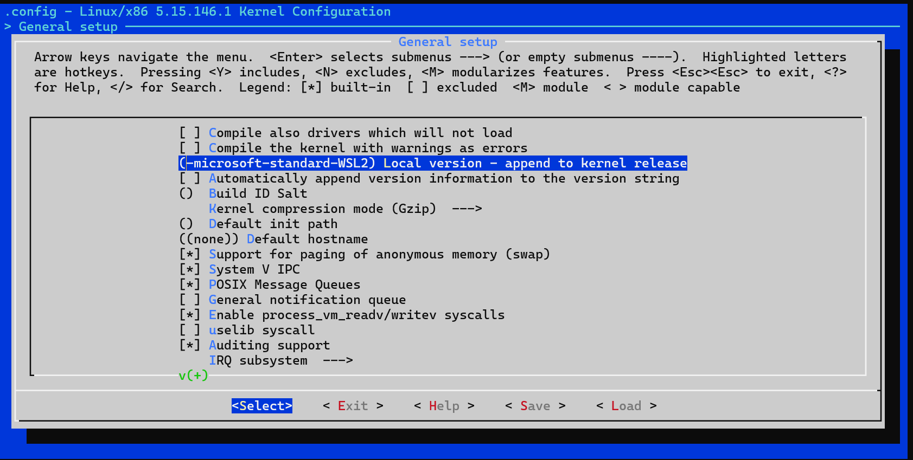

# Install Mininet, OpenVSwitch on WSL Ubuntu

> This guide should help you in installing the Mininet, OpenVSwitch on your WSL.

## 1. Overview

In Windows 10/11, for WSL, the default kernel doesn't support OpenVSwitch out of the box. So, you have to manually install the necessary packages by re-building the kernel. 

- We build the kernel which has openvswitch enabled
- Install the Mininet tool and all the other components.

> NOTE: This guide doesn't tell you how to install WSL on your system. 

> For installing WSL, follow ->


## 2. ENV check

In powershell, make sure you are on WSL version 2:


```powershell
# Update WSL to latest version
wsl --update

# Check version of WSL 
wsl -v
```

In WSL, run the following

```
# Print System Info
uname -a

# Distribution information
lsb_release -a
```

We need `systemd` to be enabled at boot for managing the processes.

```bash
cat /etc/wsl.conf
```

You are expected to get the following output:

```bash
[boot]
systemd=true
```

If not existing, just open the file with `vim` and copy paste the above 2 lines in the file `/etc/wsl.conf`


## 3. Install Packages and Clone the Official Kernel

3.1 Install the essential tools required for rebuilding.

```bash
sudo apt update
sudo apt upgrade
sudo apt install make autoconf build-essential flex bison bc dwarves libncurses-dev libssl-dev libelf-dev libtool
```


3.2. Clone the Official Microsoft WSL Kernel Source Code. 
> This is typically around 1.4GB

```bash
#Clone the source code
git clone microsoft/WSL2-Linux-Kernel
```

3.3 Now change the git tag to your current WSL kernel version.

    - To confirm your version, in WSL, run `uname -r`. You should see the output as follows or a different version. 

        ```bash
        uname -r
        5.15.146.1-microsoft-standard-WSL2-mn+ 
        ```

    - Change the tag by rubnning.

        ```bash
        # Check the available tags 
        git tag | grep 5.15
        linux-msft-wsl-5.15.123.1
        linux-msft-wsl-5.15.133.1
        linux-msft-wsl-5.15.137.3
        linux-msft-wsl-5.15.146.1
        linux-msft-wsl-5.15.57.1
        linux-msft-wsl-5.15.62.1
        linux-msft-wsl-5.15.68.1
        linux-msft-wsl-5.15.74.2
        linux-msft-wsl-5.15.79.1
        linux-msft-wsl-5.15.83.1
        linux-msft-wsl-5.15.90.1
        linux-msft-wsl-5.15.90.3
        linux-msft-wsl-5.15.90.4
        rolling-lts/wsl/5.15.68.1
        v2.6.25.15
        v4.15.15
        ```

    - CHeckout to the specific tag/branch your kernel is in. (match the tag with your current kernel version)
        
        ```bash
        git checkout refs/tags/linux-msft-wsl-5.15.146.1
        ```


## 4. Building the Kernel

4.1 Make a copy of current kernel config file.

    ```bash
    # get into the kernel dir
    cd WSL2-Linux-Kernel

    #make a copy of the configuration file
    cp ./Microsoft/config-wsl .config

    # NOTE:
    # If you want to use the current kernel configuration file 
    # RUN
    zcat /proc/config.gz > .config
    ```

4.2 Now, let's do some kernel configurations by running 

    ```bash
    make menuconfig
    ```

You should see a menu something like this. Don't be afraid, it's pretty simple - we enabling some options here. 


4.3. Now that you are in kernel configuration menu, let's enable some options to run openvswitch, controllers.

- Select Networking Support


- Select Networking Options


- Enable all options in Open vSwitch. Upon enabling, it show **&lt;M&gt;**


- Enable 802.1d Etherner Bridging in Networking Options


- Enable all options in Qos and/or fair queueing


## 5. Save configuration

- Press Exit until you see the main page which shows "General setup" on the top.


- Local version contains the setting value "-microsoft-standard-WSL2". Let's append `-mn` to it. 



- Now, exit twice by using left, right keys to move and confirm to save the configuration by selecting `YES`


## 6. Compile the Kernel

```bash
make 
```

## 7. Copy the final kernel image to WSL folder in Users (Windows)
```bash
cp arch/x86/boot/bzImage /mnt/c/Users/[USERNAME]/wsl2
```

## 8. Create `.wslconfig` file in $USERS directory in windows 
```powershell
[wsl2]
kernel = C:\\Users\\[USERNAME]\\wsl2\\bzImage
```

## 9. In cmd or powershell:

```powershell
wsl --shutdown
```
## 10. Install Kernel Modules
Open WSL and Install the build kernel modules
```bash
cd WSL2-Linux-Kernel
sudo make modules_install
```

- We can now check the kernel by running `uname -r` 

```bash
uname -r
5.15.146.1-microsoft-standard-WSL2-mn+
```

## 11. Next, we install the mininet, openvswitch libraries and start working on them. 

For confirmation, you can run `sudo systemctl status openvswitch-switch` to see the running status.

