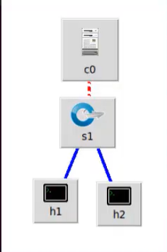
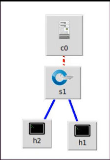
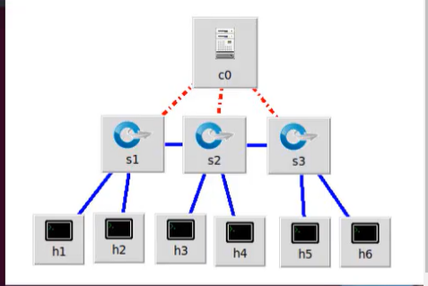
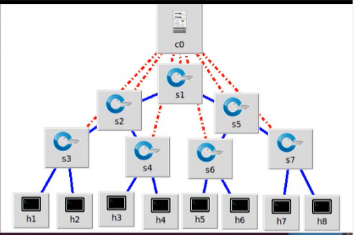
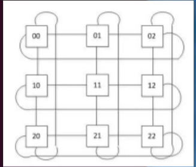

# Changing Topology Size and Type

## Topologies

Use **`--topo`**  for chaning the topology by passing parameters.

1. Running Regression Test:

    ```bash
    sudo mn --test pingall --topo single,4
    ```

    Outer:

    ```bash
    sudo mn --test pingall --topo=single,4
    *** Creating network
    *** Adding controller
    *** Adding hosts:
    h1 h2 h3 h4
    *** Adding switches:
    s1
    *** Adding links:
    (h1, s1) (h2, s1) (h3, s1) (h4, s1)
    *** Configuring hosts
    h1 h2 h3 h4
    *** Starting controller
    c0
    *** Starting 1 switches
    s1 ...
    *** Waiting for switches to connect
    s1
    *** Ping: testing ping reachability
    h1 -> h2 h3 h4
    h2 -> h1 h3 h4
    h3 -> h1 h2 h4
    h4 -> h1 h2 h3
    *** Results: 0% dropped (12/12 received)
    *** Stopping 1 controllers
    c0
    *** Stopping 4 links
    ....
    *** Stopping 1 switches
    s1
    *** Stopping 4 hosts
    h1 h2 h3 h4
    *** Done
    completed in 5.974 seconds
    ```

2. Linear Topology:

   Here each switch has one host, and all switches connect in a line.

   Run:

   ```bash
   sudo mn --test pingall --topo linear,4
   
   #or run 
   sudo mn --test pingall --topo=linear,4
   ```

    Output:

    ```bash
    sanju@SANJU:~/ComputerNetworks/Python$ sudo mn --test pingall --topo linear,4
    *** Creating network
    *** Adding controller
    *** Adding hosts:
    h1 h2 h3 h4
    *** Adding switches:
    s1 s2 s3 s4
    *** Adding links:
    (h1, s1) (h2, s2) (h3, s3) (h4, s4) (s2, s1) (s3, s2) (s4, s3)
    *** Configuring hosts
    h1 h2 h3 h4
    *** Starting controller
    c0
    *** Starting 4 switches
    s1 s2 s3 s4 ...
    *** Waiting for switches to connect
    s1 s2 s3 s4
    *** Ping: testing ping reachability
    h1 -> h2 h3 h4
    h2 -> h1 h3 h4
    h3 -> h1 h2 h4
    h4 -> h1 h2 h3
    *** Results: 0% dropped (12/12 received)
    *** Stopping 1 controllers
    c0
    *** Stopping 7 links
    .......
    *** Stopping 4 switches
    s1 s2 s3 s4
    *** Stopping 4 hosts
    h1 h2 h3 h4
    *** Done
    completed in 6.234 seconds
    ```

There are other topologies such as `tree`, `torus` : check `sudo mn -h` and play around with them.

## Topology Shapes

Reference: Youtube - [https://www.youtube.com/watch?v=wZ9a0fluDNE](https://www.youtube.com/watch?v=wZ9a0fluDNE)

1. Single:

    

2. Reversed: Interlinks are assigned in reverse order.

   

   > You can check by running `links` command in `mininet CLI`

3. Linear: Specifies a number of switches and hosts.

    

    USAGE:

    ```bash
    sudo mn --topo linear,3,2 #we have 3 switches with 2 hosts for each switch 
    ```

    Output:

    ```bash
    $ sudo mn --topo linear,3,2
    *** Creating network
    *** Adding controller
    *** Adding hosts:
    h1s1 h1s2 h1s3 h2s1 h2s2 h2s3
    *** Adding switches:
    s1 s2 s3
    *** Adding links:
    (h1s1, s1) (h1s2, s2) (h1s3, s3) (h2s1, s1) (h2s2, s2) (h2s3, s3) (s2, s1) (s3, s2)
    *** Configuring hosts
    h1s1 h1s2 h1s3 h2s1 h2s2 h2s3
    *** Starting controller
    c0
    *** Starting 3 switches
    s1 s2 s3 ...
    *** Starting CLI:
    ```

4. Tree: Creates a tree topology of a specified depth of switches. We can also specify the number of children.

   

   ```bash
   sudo mn --topo tree,3,2
   ```

   > We have created a tree of depth 3 and the last level switches have two nodes each.

   Output:

   ```bash
   $ sudo mn --topo tree,3,2
    *** Creating network
    *** Adding controller
    *** Adding hosts:
    h1 h2 h3 h4 h5 h6 h7 h8
    *** Adding switches:
    s1 s2 s3 s4 s5 s6 s7
    *** Adding links:
    (s1, s2) (s1, s5) (s2, s3) (s2, s4) (s3, h1) (s3, h2) (s4, h3) (s4, h4) (s5, s6) (s5, s7) (s6, h5) (s6, h6)
    (s7, h7) (s7, h8)
    *** Configuring hosts
    h1 h2 h3 h4 h5 h6 h7 h8
    *** Starting controller
    c0
    *** Starting 7 switches
    s1 s2 s3 s4 s5 s6 s7 ...
    *** Starting CLI:
    *** Starting CLI:
    mininet>
   ```

5. Torus: Currently, mininet supports `3x3` torus

    

    ```bash
    sudo mn --topo torus,3,3
    # we specify the lenght and breadth
    ```

    Output:

    ```bash
    $ sudo mn --topo torus,3,3
    *** Creating network
    *** Adding controller
    *** Adding hosts:
    h1x1 h1x2 h1x3 h2x1 h2x2 h2x3 h3x1 h3x2 h3x3
    *** Adding switches:
    s1x1 s1x2 s1x3 s2x1 s2x2 s2x3 s3x1 s3x2 s3x3
    *** Adding links:
    (h1x1, s1x1) (h1x2, s1x2) (h1x3, s1x3) (h2x1, s2x1) (h2x2, s2x2) (h2x3, s2x3) (h3x1, s3x1) (h3x2, s3x2) (h3x3, s3x3) (s1x1, s1x2) (s1x1, s2x1) (s1x2, s1x3) (s1x2, s2x2) (s1x3, s1x1) (s1x3, s2x3) (s2x1, s2x2) (s2x1, s3x1) (s2x2, s2x3) (s2x2, s3x2) (s2x3, s2x1) (s2x3, s3x3) (s3x1, s1x1) (s3x1, s3x2) (s3x2, s1x2) (s3x2, s3x3) (s3x3, s1x3) (s3x3, s3x1)
    *** Configuring hosts
    h1x1 h1x2 h1x3 h2x1 h2x2 h2x3 h3x1 h3x2 h3x3
    *** Starting controller
    c0
    *** Starting 9 switches
    s1x1 s1x2 s1x3 s2x1 s2x2 s2x3 s3x1 s3x2 s3x3 ...
    *** Starting CLI:
    mininet>

    ```

    > NOTE: The hosts can communicate with each other since `mininet` doesn't support the communication b/w closed networks(as of today - 26th Jan, 2024).
