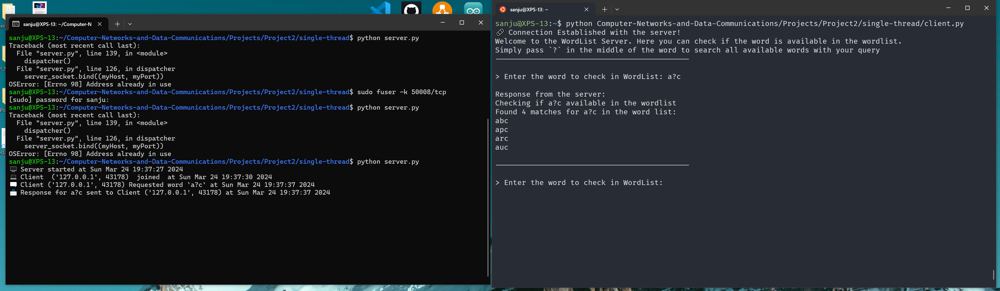
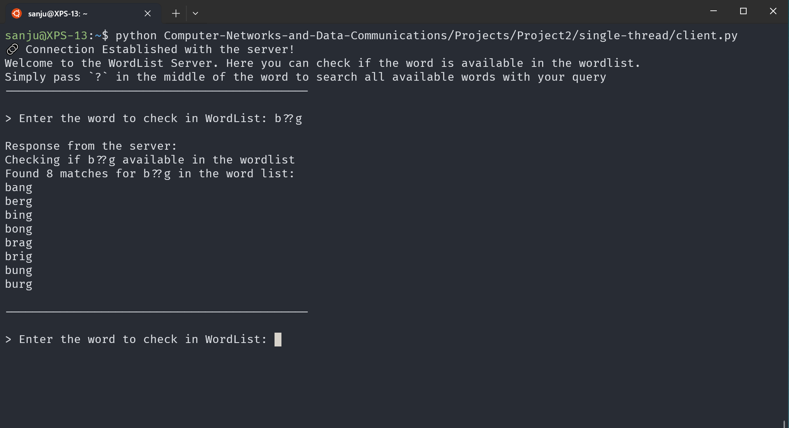
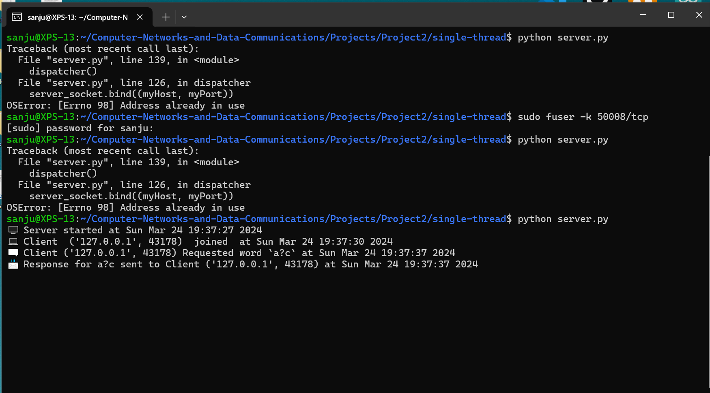

# Project 2: Socket Programming

    Name: Sai Kiran Belana
    Course: Computer Networks and Data Communications 
    Course No: CSE 5299
    NetID: skb23007

## WordList Server and Client

The WordList Server is a simple TCP server written in Python that searches for English words matching a given pattern from a client. It supports wildcard searches using '?' where '?' can be replaced by any letter. The server responds with matching words from a predefined word list file called `wordlist.txt`.

### Main Features

* **TCP Socket Programming**: Utilizes TCP sockets for reliable communication between client and server.
* **Wildcard Search**: Supports queries with '?' as a wildcard for any letter.
* **Multi-Query Support**: Handles multiple query combinations generated from wildcard patterns.
* **Single-Threaded**: Processes one client request at a time in a sequential manner.

## Single Thread Application:

### Client

The client.py file is a simple client that sends a query to the server and waits for the server to respond. 

We use the `socket` module to create a socket object and connect to the server. We have defined a function called `requestServer()` that connects to server socket and sends the user query to the server and waits for the server to respond. 

Client mainly involves two functions in order of execution:

1. **checkServerStatus()**: Checks if the server is running and accepting connections.

    This function tries to connect to the server socket. If the connection is successful, it prints `🔗 Connection Established with the server! ` and executes `requestServer()` function.

2. **requestServer()**: Sends a query to the server and waits for the server to respond.

    This function sends the user query to the server and waits for the server to respond. It reads the response from the server and prints the response to the console. The client sends the query to the server using the `client_socket.send()` function and receives the response using the `client_socket.recv()` function. The client also checks for the `END_OF_RESPONSE` string to confirm the final response is received from the server.

### Server Implementation

The server.py file is a simple TCP server that listens for incoming client connections and processes the client's query.

### Libraries Used:

1. `socket` - to create a socket object and bind it to a specific port.
2. `time` - to get the current time stamp
3. `string` - to generate all possible query combinations based on the wildcard pattern.

### Code Functionality

The server.py file mainly involves five functions in order of execution: 

1. **dispatch()**: Main loop of the server, accepting client connections and handling them.

    This function handles the socket creation, binding, and listening. It accepts incoming client connections and creates a new thread to handle each client request. The server listens on port 50008 for incoming connections which can be configured by changing the variable `myHost`.

    The server runs indefinitely until the user interrupts the program using `Ctrl+C`. The server logs the activity using the `now()` function, which returns the current timestamp in a human-readable format.

2. **now()**: Returns the current timestamp in a human-readable format. This function is used by **dispatch()** to log the server's activity.

3. **handleClient()**: Manages communication with the connected client, receiving data, and sending responses.

    This function reads the query from the client, acknowledges the client's query,
    uses `handleRequest()` function to process the query, and sends the response back to the client. 
    
    We also send `END_OF_RESPONSE` to the client to indicate the end of the response which is checked by the client to confirm the final response is received.
    
    The server logs the client's query and the matching words found in the word list using `now()` function.

4. **handleRequest()**: Handles incoming queries, searches for matching words, and generates the response.

    This function processes the query received from the client and searches for matching words in the word list using the received output `query_combos` array from `searchQueryList()` function . It generates all possible query combinations based on the wildcard pattern and searches for matching words in the word list. The function returns a list of matching words found in the word list.

5. **searchQueryList()**: Searches for matching words in the word list based on the query pattern.

    This function generates all possible query combinations based on the wildcard pattern and searches for matching words in the word list. It returns a list of matching words found in the word list.

---

## Multi-Threaded Application:

This application is an extension of the single-threaded application with the following features:

* **Multi-Threaded Server**: Supports multiple client connections concurrently using threads.
* **Client Threads**: Each client connection is handled by a separate thread on the server.

### Additional Libraries Used:

1. `_thread` - to create and manage threads for each client connection.

### Client

The client.py file is a copy of the single-threaded client with no changes. It performs the same functions as the single-threaded client.

### Server

The server.py file is an extension of the single-threaded server with multi-threading support. It creates a new thread for each client connection to handle multiple client connections concurrently.

We use the `_thread` module to create and manage threads for each client connection. 

The server creates a new thread for each client connection using the `thread.start_new_thread()` function.

---

### Fixes and Improvements:

https://stackoverflow.com/questions/5875177/how-to-close-a-socket-left-open-by-a-killed-program
