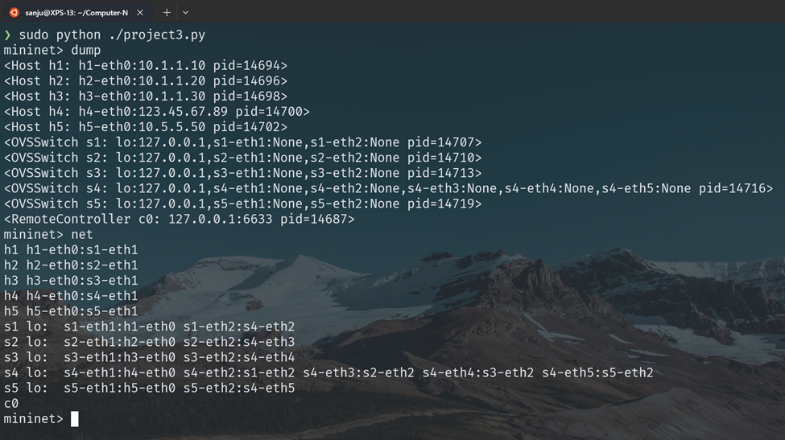

# Project 3: Implementing a Simple Router

In this project, we will implement routing between devices on different subnets, and implementing firewalls for certain subnets. The idea is to simulate an actual production network. We will be using ideas from project 1 to help construct the Mininet topology, and then implement the rules allowing for traffic to flow through your
network.

### Mininet Topology

