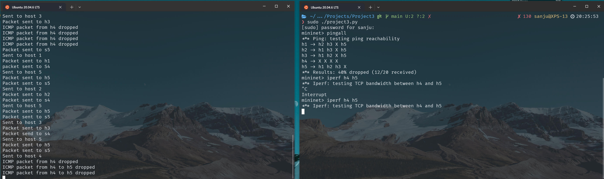

# Project 3: Implementing a Simple Router

In this project, we will implement routing between devices on different subnets, and implementing firewalls for certain subnets. The idea is to simulate an actual production network. We will be using ideas from project 1 to help construct the Mininet topology, and then implement the rules allowing for traffic to flow through your
network.

> All outputs are stored in a folder called `logs`. To see the output, run `cat name_of_log_file.log` in your linux terminal.

## Mininet Topology

### `dump`

Log File: [dump.log](./logs/dump.log)

We display all the hosts, switches including the untrusted host and server. 

| Host | Switch | Device | IP Address |
| ---- | ------ | -----  | ---------  |
| h1   |   s1   | Floor 1 Host | 10.1.1.10/24 |
| h2   | s2     | Floor 2 Host | 10.2.2.20/24 |
| h3   |   s3   | Floor 3 Host | 10.3.3.30/24 |
| h4   |    s4  | Untrusted Host | 123.45.67.89 |
| h5   |    s5  | Server | 10.5.5.50/24 |

---

## Pox Controller

### `pingall`

Log File: [pingall.log](./logs/pingall.log)

`pingall` command shows the status of all hosts pinging each other in the network. 

Since `h4` host is an untrusted host, we block all the `ICMP` traffic passing through switch `s4`

### `iperf`

Log File: [iperf.log](./logs/iperf.log)

In this section, we see the `h4`, untrusted network, cannot send ANY traffic to Server but can send traffic to all other hosts except `ICMP` messages.

1. `h4` to `h5`:

    
    This traffic is blocked since the untrusted host cannot communicate with the server with any protocol.

2. `h1` to all IP addresses in network and also the untrusted host

    

3. `h2` to all IP addresses

    

4. `h3` to all IP addreses

    

5. `h4` to all IP addresses

    

6. `h5` to all IP addresses

    

### `dpctl dump-flows`

Log file: [dpctl-dump-flows.log](./logs/dpctl-dump-flows.log)

Attaching the screenshots for the output for `dpctl dump-flows` command. A detailed output as been saved to a log file called [dcptl-dump-flows.log](./logs/dpctl-dump-flows.log). This log can be called with `cat ./logs/dpctl-dump-flows.log` in bash shell.

